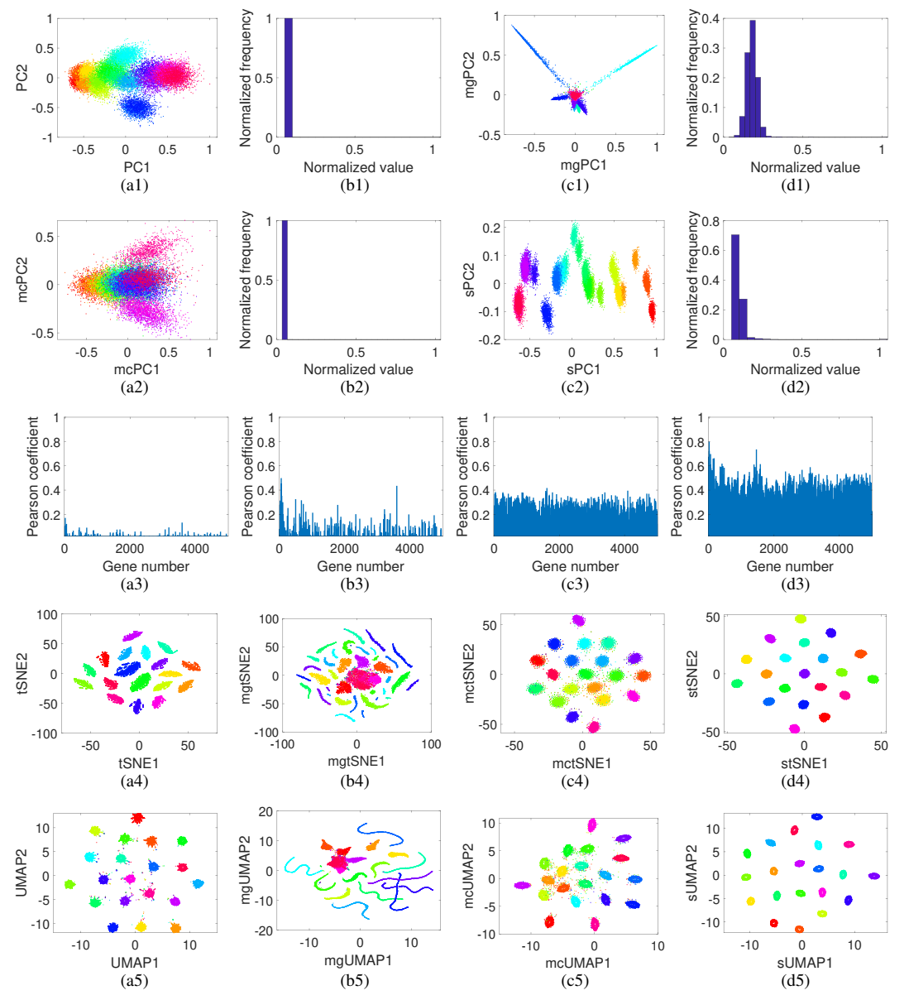

# self-consistent-expression-recovery-machine (SERM)
SERM is a data-driven gene expression recovery framework. Using deep learning, SERM first learns from a subset of the noisy gene expression data to estimate the underlying data distribution. SERM then recovers the overall gene expression data by analytically imposing a self- consistency on the gene expression matrix, thus ensuring that the expression levels are similarly distributed in different parts of the matrix.

# How to use SERM?
## Requirements
The ```requirements.txt``` file should list all Python libraries that our notebooks depend on. And if you are using conda, you can create a file by

```conda create --name <env> --file requirements.txt```

## Input data and parameters
The gene expression data should be in matrix format (rows are cells and collumns are genes). There are a few parameters: 1) ROI length and width: SERM divides the whole matrix into a number of ROIs. The user can choose the size of the ROI that would be used by SERM. Good values for ROI height can be: cell number divided by 4 or 8 and ROI width can be gene number divided by 4 or 8. 2) Percent overlap: This parameter dictates how much overlap will be between two consecutive ROIs. The user can choose any value between 0.01 to 0.99. However, for small overlap, the consecutive windows would be disconnected and for large window size, more computation will be necessary. A value between 0.25 or 0.75 works well with SERM. The requirements of different packages in Python are described in requirements.txt. 

## About parameter settings:
SERM works well for a large range of parameters. Thus, even without careful settings, it provides much better results than traditional techniques.

# Where do I get all the data used in the manuscript?
Please download all the reference and observed data for all six datasets from the following Google Drive link. 

https://drive.google.com/drive/folders/1w72k3fCQlS2UtGg2TdY8CihTwavEmz89?usp=sharing

Please refer to our Nature Communications paper, if you use the data/code in your research.

# Citation:

Islam, M.T., Wang, JY., Ren, H. et al. Leveraging data-driven self-consistency for high-fidelity gene expression recovery. Nat Commun 13, 7142 (2022). https://doi.org/10.1038/s41467-022-34595-w

# Code Ocean capsule:

You can run our reproducible code ocean capsule, where you just need to click once to obtain the results. Link to the capusule: https://doi.org/10.24433/CO.7874136.v1

# Example:
Please see the Jupyter notebook ``` demo_serm.ipynb```or MATLAB demos for an easy start.  Enjoy! 

# Results:


Figure. Analysis of simulated scRNA-seq data with 5 classes. The histograms of the original data, downsampled data,
and imputed data by MAGIC, mcImpute, and SERM are shown in the first row of (a). The learned distribution by SERM in
this case is exponential. Visualization of original, downsampled, and imputed data by t-SNE and UMAP are shown in the
second and third rows, respectively. t-SNE and UMAP results from SERM imputed data are much better in separating the
classes, when compared to other techniques. The clustering accuracy and cluster quality indices for
t-SNE visualizations of imputed data from different methods are shown in (b).
